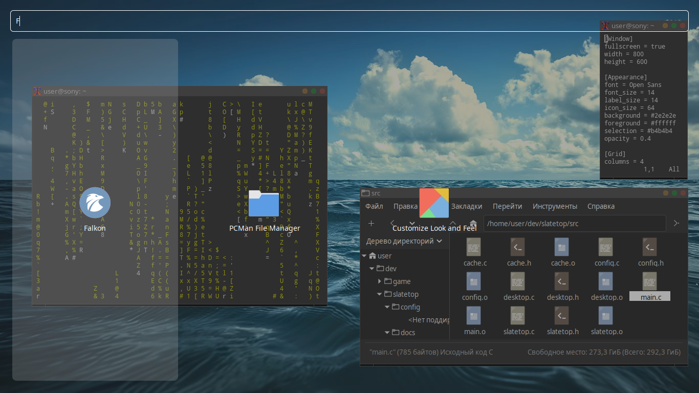

# Slatetop

A modern, flat, lightweight application launcher for X11.

Slatetop is a minimal launcher written in C with GTK3. It reads standard
`.desktop` files, caches them for fast startup, and provides a full-screen
searchable grid of applications. Designed to work in any X11 environment
(Openbox, i3, dwm, etc.) with minimal dependencies.

## Features

- Full-screen flat interface with semi-transparent background
- Instant search filtering by application name
- Application caching for sub-second startup
- Simple INI-based configuration
- Configurable fonts, colors, icon size, opacity, and grid columns
- Minimal dependencies: only GTK3 and GLib
- `--reload-apps` flag to rebuild the cache after installing new software

## Screenshots

## Requirements

- GTK3 (`libgtk-3-dev`)
- GLib (comes with GTK3)
- GCC
- Make
- pkg-config

On Debian/Ubuntu/antiX:

    sudo apt install build-essential pkg-config libgtk-3-dev

## Build

    make

## Install

    sudo make install

This installs `slatetop` to `/usr/local/bin`.

## Configuration

On first run, Slatetop creates a default configuration at
`~/.config/slatetop/slatetop.conf`. See `config/slatetop.conf` for a full
example with all available options.

After installing new applications, rebuild the cache:

    slatetop --reload-apps

## Documentation

- [Architecture](docs/ARCHITECTURE.md)
- [Usage](docs/USAGE.md)

## License

MIT - see [LICENSE](LICENSE).

## Author

Akhmetshin Islam Rustemovich
